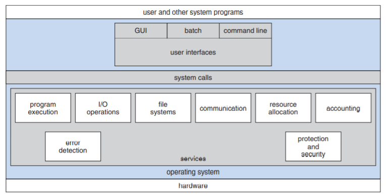
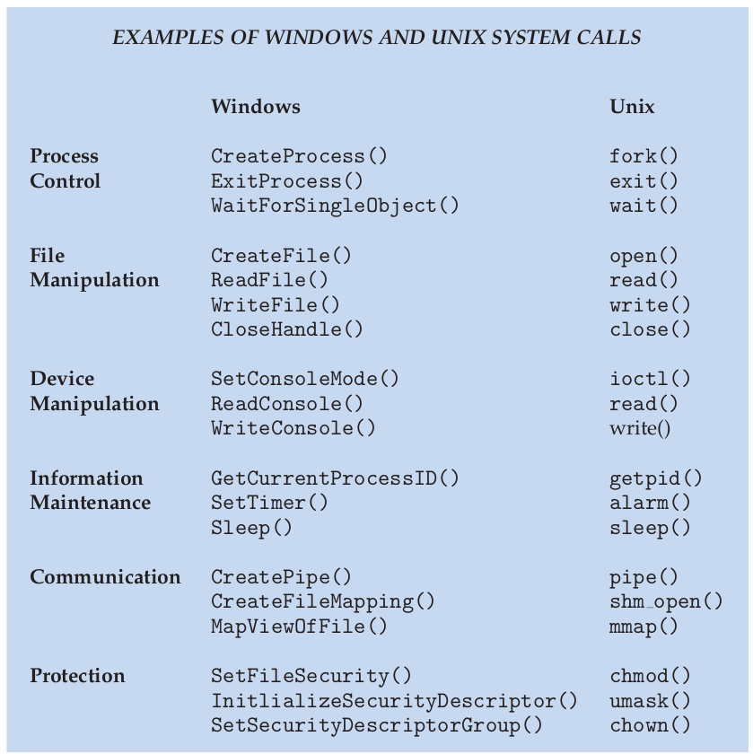
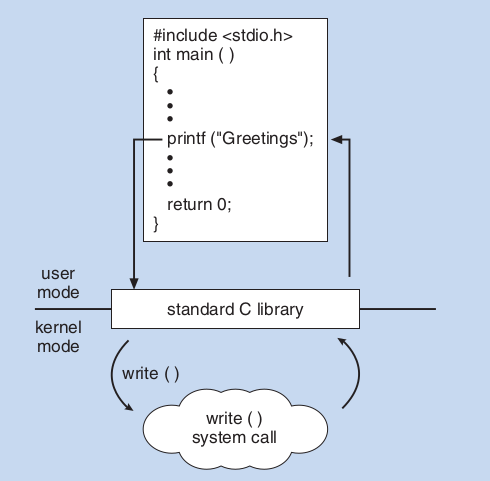
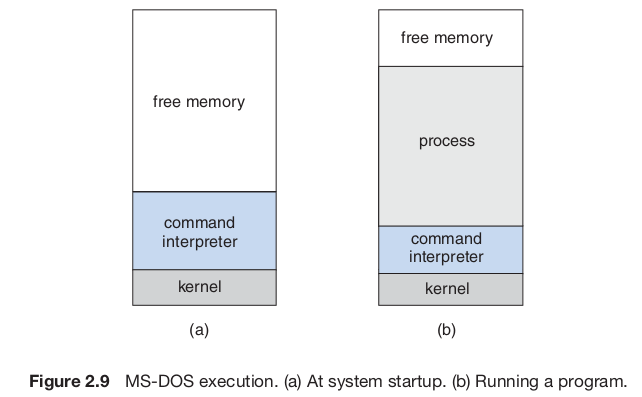

# Chapter 2 - Operating System Structures

# Chapter Objectives

- Describe services an os provides to users, processes, and other systems
- Discuss various ways of structuring an os
- Explain how operating systems are installed and customized and how they boot

# 2.1 Operating-System Services

Figure 2.1 A view of operating system services

- Functions that help the user:
    - **User interface (UI)** - command line interface (CLI) or batch interface (files with commands), or graphical user interface (GUI)
    - **Program execution** - Load program into memory and run
    - **I/O Operations** - means to do I/O so that users do not control devices directly
    - **File-system manipulation** - read and write files and directories, sometimes include permissions
    - **Communications** - communication between processes on same or separate system, use **shared memory** or **message passing**
    - **Error detection** - handle errors gracefully to ensure consistent computing - sometimes need to halt the system
- Functions that ensure efficient operation of system
    - **Resource allocation** - resources allocated to multiple users or multiple jobs running at the same time (e.g. CPU-scheduling routines)
    - **Accounting** - which users use how much and what kinds of computer resources
    - **Protection and security** - keep one process from interfering with others or os itself when running concurrently - all access to system resources is controlled

# 2.2 User and Operating-System Interface

## 2.2.1 Command Interpreters

- **command line interpreter** - get and execute the next user-specified command
- two general ways for commands to be implemented
    - command interpreter itself contains the code to execute the command
    - system programs (used by UNIX) - uses command to load file into memory and execute

## 2.2.2 Graphical User Interfaces

- users employ mouse-based window and menu system characterized by a **desktop**

# 2.3 System Calls

- **System calls** - provide interface to the services made available by an os
    - generally available as routines written in C and C++ (maybe assembly for certain low level tasks)
- Even simple programs make many system calls - most programmers do not see this level of detail

    Figure 2.5 Example of how system calls are used

- instead design according to **application programming interface (API) -** specifies set of functions that are available to application programmer
    - Windows - Windows API
    - POSIX (UNIX, Linux, and Mac OS X) - POSIX API
    - JVM (Java Virtual Machine) - Java API
- functions in API invoke actual system call on behalf of programmer
- Why use API?
    - Can compile program on any system using same API
    - system calls may be detailed and difficult to work with
- **system-call interface** - link to system calls made available by os

Figure 2.6 The handling of a user application invoking the open() system call

- Three general methods used to pass parameters to system calls
    - pass parameters in registers - may be more parameters than registers
    - parameters stored in block or table in memory and address passed
    - parameters pushed onto stack by program and popped off by os

Figure 2.7 Passing of parameters as a table

# 2.4 Types of System Calls

- Process control
  - end, abort
  - load, execute
  - create process, terminate process
  - get process attributes, set process attributes
  - wait for time
  - wait event, signal event
  - allocate and free memory
- File management
  - create file, delete file
  - open, close
  - read, write, reposition
  - get file attributes, set file attributes
- Device management
  - request device, release device
  - read, write, reposition
  - get device attributes, set device attributes
  - logically attach or detach devices
- Information maintenance
  - get time or date, set time or date
  - get system data, set system data
  - get process, file, or device attributes
  - set process, file, or device attributes
- Communications
  - create, delete communication connection
  - send, receive messages
  - transfer status information
  - attach or detach remote devices

## 2.4.1 Process Control

- Running program needs to be able to halt execution either normally (`end()`) or abnormally (`abort()`)
- Use a process or job to `load()` and `execute()` another program
- Return control when loaded program terminates - depends if existing program is lost, saved, or allowed to continue execution concurrently with new program
- Use system calls for this purpose `create_process()` or `submit_job()`

- multiple processes may share data - system calls allow process to **lock** shared data

## 2.4.2 File Mangaement

- Need to be able to:
  - create, delete files
  - open and use it
  - read, write or reposition (rewing or skip to the end of the file)
  - close file
  - access and modify file attributes

## 2.4.3 Device Management

- Can be very similar to file management
- I/O devices can even be treated by OS in the same way as file

## 2.4.4 Information Maintenance

- system calls that exist to transfer information between user program and os

## 2.4.5 Communication

- **message-passing model** - communicating processes transfer messages with one another
- **shared-memory model** - create and gain access to regions of memory owned by other processes

## 2.4.6 Protection

- mechanism for controlling access to resources provided by computer system

# 2.5 System Program

- 