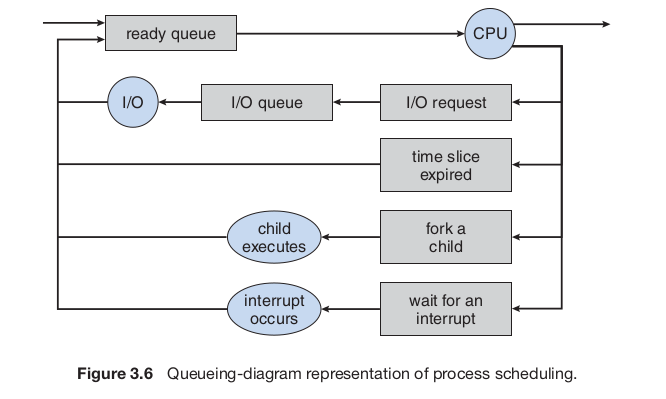

# Chapter 3 - Processes

## Chapter Objectives

- Introduce notion of a process - a program in execution - basis of all computation
- Descrive the avrious features of processes - scheduling, creation, and termination
- Explore interprocess communication using shared memory and message passing
- Describe communication in client-server systems

## 3.1 Process Concept

- What to call CPU activities
  - Batch system executes jobs
  - time-shared system has user programs or tasks
  - OS may also need to support internal programmed activities such as memory management
- Refer to activities as **process**

### 3.1.1 The Process

- **Process** - program in execution
  - Code - text section
  - Current activity - program counter
  - Contents of processor's registers
  - Process stack - temporary data such as function parameters and return addresses
  - Data secion - global variables
  - Heap - memory that is dynamically allocated during process run time
  
- Program is **passive** entity - process is **active entity**

### 3.1.2 Process State

- As a process executes it changes **state**:
  - **New** - being created
  - **Running** - Instructions being executed
  - **Waiting** - Process waiting for some event to occur
  - **Ready** - process is waiting to be assigned to a processor
  - **Terminated** - finished execution

### 3.1.3 Process Control Block

- Each process represented in os by a **process control block (PCB)**
  
- PCB contains many pieces of information for each process:
  - **Process state** - state may be new, ready, running, waiting, halted
  - **Program Counter** - the counter indicates the address of the next instruction to be executed for the process
  - **CPU registers** - Vary in number and type, depending on comp architecture
    - accumulators, index registers, stack pointers, and general-purpose registers, plus any condition-code information
    - state of counter must also be saved when an interrupt occurs
  - **CPU-Scheduling information** - process priority, pointers to scheduling queues, any other scheduling paramters
  - **Memory-management information** - value of base limit registers and page tables, or segment tables, depending on the memory system used by the operating system
  - **Accounting information** - Amount of CPU and real time used, time limits, account numbers, job or process numbers
  - **I/O Status Information** - includes the list of I/O devices allocated to the process, list of open files, etc.
  
  

### 3.1.4 Threads

- Modern operating systems have extended the process concept to allow a process to have multiple threads of execution

## 3.2 Process Scheduling

- OBjective of multiprogramming is to have some process running at all times, to max CPU utilization
- **Process scheduler** - selects available process for program exectuion on CPU


### 3.2.1 Scheduling Queues

- When process enters sytem put into job queue
- Processes ready for execution kept in a list called ready queue
  

### 3.2.2 Schedulers

+ **long-term schedule (job scheduler)** - selects processes from pool in mass storage device and loads into memory for execution
+ **short-term scheduler (CPU scheduler)** - selects from among the processes that are ready to execute and allocates the CPU to one of them
+ most processes are either **I/O-Bound** - spends more time doing I/O than doing computations or **CPU-bound** - spends more time doing computations than I/O

### 3.2.3 Context Switch

+ When interrupt occurs system needs to save current context of process running on the CPU so it can restore it - **state save and state restore**

## 3.3 Operations on Processes

### 3.3.1 Process Creation

+ Processes spawn into a tree of processes
+ Most operating systems assign unique id to processes **pid**
  
+ When a process creates a new process - two possibilities:
  + Parent continues to execute concurrently with children
  + Paret waits until some or all of children have terminated

```c++
#include < sys/types.h >
#include < stdio.h >
#include < unistd.h >
int main()
{
    pid t pid;
    /* fork a child process */
    pid = fork();
    if (pid < 0) { /* error occurred */
        fprintf(stderr, "Fork Failed");
        return 1;
    }
    else if (pid == 0) { /* child process */
        execlp("/bin/ls","ls",NULL);
    }
    else { /* parent process */
    /* parent will wait for the child to complete */
        wait(NULL);
        printf("Child Complete");
    }
}
return 0;
```


### 3.3.2 Process Termination

+ Process terminates when it finishes executing final statement and asks os to delete it by using the `exit()` system call
+ Parent process can also terminate children process
  + child has exceeded usage of resources allocated
  + task assigned to child no longer required
  + parent terminates (cascading termination)

## 3.4 Interprocess Communication

