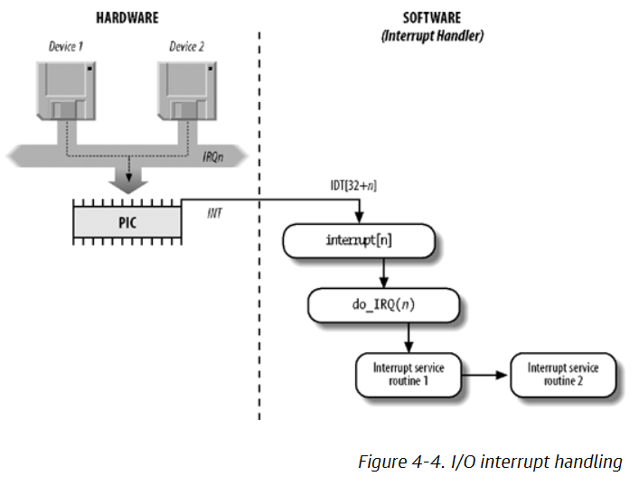

# Discussion

**Discussion**

IRQs are interrupt requests that come from devices to the CPU. When a device souch as a sound car, keyboard, or disk drive needs to do something, it sends an IRQ to the CPU. The CPU then does the required action based on the priority of the device requesting the interrupt.

To make interrupt handlers more flexible, several devices may share the same IRQ line. This functionality can be handled in two ways. The first is IRQ sharing where the interrupt handler executes multiple interrupt service routines assigned to the IRQ to determine which device needs attention. The second is dynamic allocation where the device driver is only assigned to an IRQ line only at the moment the device is needed.

An example of the interrupt process can be seen below:


**Lab Results**

The lab was a good way to see the interrupts on my system. It was 
interesting to use the `watch` command to see the interrupts happening in real time.

```
cat /proc/interrupts
```

```
          CPU0       CPU1       CPU2       CPU3       
  0:         29          0          0          0   IO-APIC   2-edge      timer
  1:          0          0        334          0   IO-APIC   1-edge      i8042
  8:          0          0          0          0   IO-APIC   8-edge      rtc0
  9:          0          0          0          0   IO-APIC   9-fasteoi   acpi
 12:          0       1050          0          0   IO-APIC  12-edge      i8042
 14:          0          0          0          0   IO-APIC  14-edge      ata_piix
 15:          0          0          0       3444   IO-APIC  15-edge      ata_piix
 18:          0       2225          0          0   IO-APIC  18-fasteoi   vmwgfx
 19:          0          0          0       2854   IO-APIC  19-fasteoi   enp0s3
 20:          0          0       3813          0   IO-APIC  20-fasteoi   vboxguest
 21:      13499          0       5809          0   IO-APIC  21-fasteoi   ahci[0000:00:0d.0], snd_intel8x0
 22:         28          0          0          0   IO-APIC  22-fasteoi   ohci_hcd:usb1
NMI:          0          0          0          0   Non-maskable interrupts
LOC:      60636      79591      71661     118405   Local timer interrupts
SPU:          0          0          0          0   Spurious interrupts
PMI:          0          0          0          0   Performance monitoring interrupts
IWI:          0          0          0          0   IRQ work interrupts
RTR:          0          0          0          0   APIC ICR read retries
RES:      31806      32129      31037      28382   Rescheduling interrupts
CAL:       3118      10803       4554       5783   Function call interrupts
TLB:       3666       4165       3018       5034   TLB shootdowns
TRM:          0          0          0          0   Thermal event interrupts
THR:          0          0          0          0   Threshold APIC interrupts
DFR:          0          0          0          0   Deferred Error APIC interrupts
MCE:          0          0          0          0   Machine check exceptions
MCP:         11         11         11         11   Machine check polls
ERR:          0
MIS:          4
PIN:          0          0          0          0   Posted-interrupt notification event
NPI:          0          0          0          0   Nested posted-interrupt event
PIW:          0          0          0          0   Posted-interrupt wakeup event
```

```
cat /proc/stat
```

```
cpu  4730 1140 2170 70033 823 0 238 0 0 0
cpu0 1349 63 546 17501 135 0 83 0 0 0
cpu1 1291 478 554 17175 246 0 58 0 0 0
cpu2 1013 401 523 17554 277 0 50 0 0 0
cpu3 1076 196 546 17801 164 0 46 0 0 0
intr 181821 29 209 0 0 0 0 0 0 0 0 0 0 290 0 0 300 0 0 911 906 1575 17764 28 0 0 0 0 0 0 0 0 0 0 0 0 0 0 0 0 0 0 0 0 0 0 0 0 0 0 0 0 0 0 0 0 0 0 0 0 0 0 0 0 0 0 0 0 0 0 0 0 0 0 0 0 0 0 0 0 0 0 0 0 0 0 0 0 0 0 0 0 0 0 0 0 0 0 0 0 0 0 0 0 0 0 0 0 0 0 0 0 0 0 0 0 0 0 0 0 0 0 0 0 0 0 0 0 0 0 0 0 0 0 0 0 0 0 0 0 0 0 0 0 0 0 0 0 0 0 0 0 0 0 0 0 0 0 0 0 0 0 0 0 0 0 0 0 0 0 0 0 0 0 0 0 0 0 0 0 0 0 0 0 0 0 0 0 0 0 0 0 0 0 0 0 0 0 0 0 0 0 0 0 0 0 0 0 0 0 0 0 0 0 0 0 0 0 0 0 0 0 0 0 0 0 0 0 0 0 0 0 0 0 0 0 0 0 0 0 0 0 0 0 0 0 0 0 0 0 0 0 0 0 0 0 0 0 0 0 0 0 0 0 0 0 0 0 0 0 0 0 0 0 0 0 0 0 0 0 0 0 0 0 0 0 0 0 0 0 0 0 0 0 0 0 0 0 0 0 0 0 0 0 0 0 0 0 0 0 0 0 0 0 0 0 0 0 0 0 0 0 0 0 0 0 0 0 0 0 0 0 0 0 0 0 0 0 0 0 0 0 0 0 0 0 0 0 0 0 0 0 0 0 0 0 0 0 0 0 0 0 0 0 0 0 0 0 0 0 0 0 0 0 0 0 0 0 0 0 0 0 0 0 0 0 0 0 0 0 0 0 0 0 0 0 0 0 0 0 0 0 0 0 0 0 0 0 0 0 0 0 0 0 0 0 0 0 0 0 0 0 0 0 0 0 0 0 0 0 0 0 0 0 0 0 0 0 0 0 0 0 0 0 0 0 0 0 0 0 0 0 0 0 0 0 0
ctxt 285008
btime 1605664720
processes 2326
procs_running 1
procs_blocked 0
softirq 135840 4 32081 47 1159 18566 0 250 17882 0 65851
```

From the above output, my system had `181,821` interrupts.

```
dmidecode –q
```

```
BIOS Information
	Vendor: innotek GmbH
	Version: VirtualBox
	Release Date: 12/01/2006
	Address: 0xE0000
	Runtime Size: 128 kB
	ROM Size: 128 kB
	Characteristics:
		ISA is supported
		PCI is supported
		Boot from CD is supported
		Selectable boot is supported
		8042 keyboard services are supported (int 9h)
		CGA/mono video services are supported (int 10h)
		ACPI is supported

System Information
	Manufacturer: innotek GmbH
	Product Name: VirtualBox
	Version: 1.2
	Serial Number: 0
	UUID: fa35f779-d968-6344-8fd5-79c51aa40dad
	Wake-up Type: Power Switch
	SKU Number: Not Specified
	Family: Virtual Machine

Base Board Information
	Manufacturer: Oracle Corporation
	Product Name: VirtualBox
	Version: 1.2
	Serial Number: 0
	Asset Tag: Not Specified
	Features:
		Board is a hosting board
	Location In Chassis: Not Specified
	Type: Motherboard

Chassis Information
	Manufacturer: Oracle Corporation
	Type: Other
	Lock: Not Present
	Version: Not Specified
	Serial Number: Not Specified
	Asset Tag: Not Specified
	Boot-up State: Safe
	Power Supply State: Safe
	Thermal State: Safe
	Security Status: None

OEM Strings
	String 1: vboxVer_6.1.12
	String 2: vboxRev_139181
```

I did not see any IRQ specific information in the above output, but it was interesting to see the Virtual Box information, which is the virtual computer software I am using to run Linux.

One useful IRQ utility tool is View -> Resources by connection in Device Manager in Windows operating systems.

**Resources**

(2020). Interrupt Handling. Retrieved from https://www.oreilly.com/library/view/understanding-the-linux/0596005652/ch04s06.html.

(2020). IRQ. https://techterms.com/definition/irq.

(2019). Show devices by their IRQ. http://maxedtech.com/show-devices-by-irq-in-windows/.

**Response**

Hi James,

Thanks for sharing this information on subshells. I had not heard about subshells before so this is really helpful.

I find it really useful that we can take advantage of multi-threaded execution in bash. I also like your use of the `fortune` command in bash. I didn't know that existed either!

