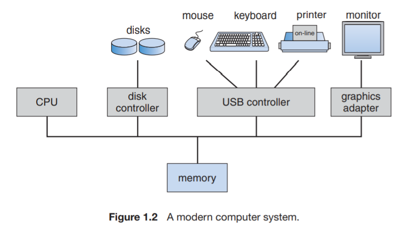
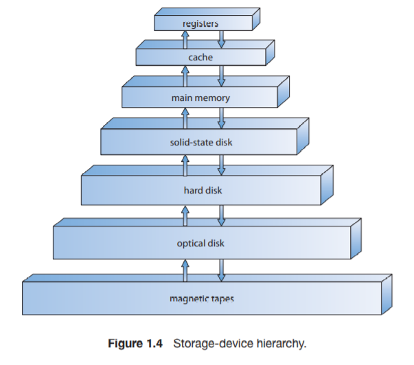
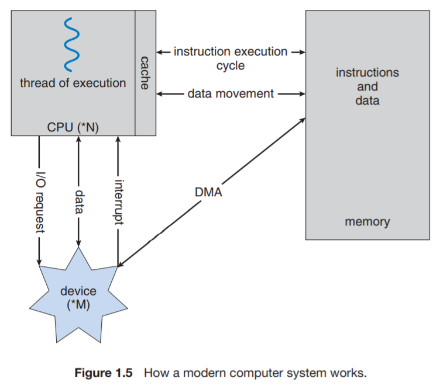
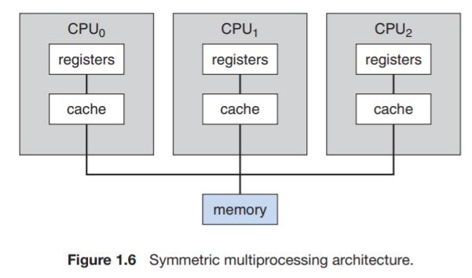

# Chapter 1 - Introduction to Operating Systems

# 1.1 **What do operating systems do?**

- Computer system divided into four components:
    - hardware - CPU, memory, i/o devices
    - operating system
    - application programs - word processors, spreadsheets, compilers, web browsers, ect.
    - users - controls hardware and coordinates its use among the various application programs for the various users
- Operating system can be seen from 2 viewpoints

## 1.1.1 User

- Depends on interface being used
- Human user with keyboard, monitor, and mouse
    - OS designed for ease of user - some attention paid to performance and none to resource utilization (how hardware and software resources are shared)
- Mainframe with other users sharing resources
    - max resource utilization
- Workstations connected to networks of servers
    - users have dedicated resources but also shared resources
    - OS compromises between individual and resource utilization

## 1.1.2 System

- OS is a resource allocator
    - Also a control program - manages the execution of programs to prevent errors and improper use of the computer

## 1.1.3 Defining Operating Systems

- No universal definition of an OS
    - One common definition - OS is one system, running at all times on the computer - usually called the kernel
        - System programs - associated with OS but not part of the kernel
        - Application programs - all others not assoviated with OS
        - Middleware - set of software frameworks that provide additional services to application developers

# 1.2 **Computer System Organization**

## 1.2.1 Computer-System Operation

- Modern general-purpose computer system
    - One or more CPUs
    - Device controllers connected through common bus that provides access to shared memory
        - Each device controller in charge of specific device (e.g. disk drivers, video displays)
    - Memory controller synchronizes access to the memory
- When computer is powered up - needs na initial program to run (bootsrap program) - stored within read-only memory (ROM)
    - Must locate the operating-system kernel and load it into memory
    - Also loads system processes (system daemons) that run entire time kernel is running
- Occurence of event is signaled by an interrupt
    - Table of interrupt pointers stored in low memory (interrupt vector) points interrupts to the correct interrupt routine

## 1.2.2 **Storage Structure**

- CPU load instructions from memory - from RAM
- Typical instruction-execution cycle (von Neumann Architecture)
    - fetch instruction from memory and store in intruction register
- Main memory is fast, but volatile and too small to hold all program data
    - secondary storage device is hard disk drive (HDD)

## 1.2.3 **I/O Structure**

- Device controllers in charge of specific type of device
- Device driver for each device controller
- I/O operations can use interrupt-driven communication with CPU
- For larger amounts of I/O data, use **direct memory access (DMA)**
    - device controller transfers entire block of data directly to or from its own buffer storage to memory - no intervention from CPU

# 1.3 Computer-System Architecture

## 1.3.1 Single-Processor Systems

- Single processor - one main CPU capable of executing general-purpose instructions from user processes
    - Other special-purpose micro-processors as well (e.g. disks keyboard graphics controllers, I/O processors)
        - Only run limited instruction set not user processes

## 1.3.2 Multiprocessor Systems

- ❓*Give examples of symmetric and asymmetric multiprocessing and how each works.*

    In asymmetric multiprocessing, each processor is designated to a specific task. There is a boss processor that controls what tasks the other processors do.  An example of asymmetric multiprocessing is SunOS Version 4. In symmetric multiprocessing, each processor performs any task, and they are all peers. This means there is no "boss" processor. All of the processors in this setup share physical memory.  An example of a symmetric processor system is AIX designed by IBM, which can use dozens of processors.

- Two or more processors sharing computer bus and sometimes clock, memory, and peripheral devices
- Advantages:
    - **Increased throughput** - more done, less time - increase in N processors is not increase in speed by N
    - **Economy of Scale** - cheaper than many single-processor systems
    - **Increased reliability** - Failure of one processor will not halt system
- Providing service proportional to level of surviving hardware - **graceful degradation**
- Go beyond this - **fault tolerant** - system can suffer a failure of any single component and still continue to operate - detect, diagnose, and if possible correct
- Two types of multiprocessor systems
    - **asymmetric** - boss processor controls system and assigns each processor to one task
    - **symmetric** (most common) - each processor performs all tasks - peer to peer (no boss)

- Multiple computing cores on a single chip - **multicore**
    - Can be more efficient than single cores because on chip communication is faster than between chip communication
    - Multicore systems are multiprocessor - not all multiprocessor systems are multicore

## 1.3.3 Clustered Systems

- Gathers together multiple CPUs - two or more individual systems (nodes) joined together - **loosely coupled**
- Provides **high-availability** service - service will continue if one or more system in the cluster fails
- **asymmetric clustering** - one machine in hot-standby mode while other is running application
    - If the watched server fails, the hot-standby host becomes the active server
- **symmetric clustering** - two or more hosts running applications - monitor each other
- **high-performance computing** - supply greater computational power because can run application concurrently on all computers in cluster
    - Application must be written to take advantage of **parallelization**
- System must also supply access control and locking - **distributed lock manager (DLM)**
- **storage-area-networks (SANs)** - allow many systems to attach to a pool of storage

Figure 1.8 General Structure of a clustered system

# 1.4 Operating-System Structure

Figure 1.9 Memory layout for a multiprogramming system

- **Multiprogramming** - increases CPU utilization by organizing jobs (code and data) - CPU always has one to execute
- Several jobs kept in memory simultaneously - initially kept on disk in the job pool
- Some subset of jobs in pool loaded into memory - CPU starts working on a job, when job has to wait for some task the CPU grabs another job from the pool - never out of jobs to do
- **Time sharing (multitasking)** - CPU executes multiple jobs by switching among them, switches occur so frequently,  users can interact with each program while it is running
    - Requires **interactive** computer system - direct communication between user and system
    - Allows many users to share resources - each user has one program (**process**) loaded into memory
    - Several jobs must be kept in memory simultaneously - if several jobs read to be brought into memory - but not enough room - then system must user **job scheduling** to make decision
    - If several jobs are ready to run at the same time, system must also choose using **CPU scheduling**
- Reasonable response time is sometimes accomplished using **swapping** - processes swapped in and out of main memory to disk
- **Virtual memory** - allows execution of a process that is not completely in memory

# 1.5 Operating-System Operations

- Modern operating systems - **interrupt driven**
    - events almost always signaled by occurrence of an interrupt or **trap** **(exception)** - software-generated interrupt caused by error or specific request from a user program that operating-system service needs to be performed

## 1.5.1 Dual-Mode and Multimode Operation

- ❓*Some computer systems do not have a privileged mode in hardware. Can these systems be secured? Provide arguments that support and refute the argument that these systems can be secured.*

    The mode bit that specifies when a system is in user mode or system mode (privileged mode) is an important part of securing a system against bad user requests. System calls protect users from accidentally or purposefully executing bad actions that can do damage to the operating system. Some alternatives to modes exist, however, such as privilege levels, but theses still provide some mechanism for controlling what actions a user can do on a system level. Without any concept of modes the system could potentially be faster, as control does not need to be passed between user and kernel mode. However, running without controlling what a user can do allows programs to do anything including wiping out the operating system by writing over it.

- Modes of operation - allows distinguish between os code and user-defined code
    - **User mode**
    - **Kernel mode (supervisor mode, system mode, privileged mode)**
- Mode bit added to hardware of computer - indicates kernel (0) or user (1)

Figure 1.10 Transition from user to kernel mode

- Some machine instructions that may cause harm marked as **privileged instructions** - can only be executed in kernel mode

## 1.5.2 Timer

- **timer** - can be set to interrupt computer after a specific period - avoids infinite loop or failed call to system services that never return control to the os
    - Period can be fixed (e.g. 1/60 seconds) or variable (e.g. 1 millisecond to 1 second)

# 1.6 Process Management

- **process** - a program in execution
    - needs certain resources (e.g. CPU time, memory, files, I/O devices)
    - **program** - passive entity, **process** - active entity

# 1.7 Memory Management

- Main memory - central to os - large array of bytes, quickly accessible
    - Several programs must be kept in memory - creates need for memory management

# 1.8 Storage Management

- **file**- logical abstraction for storage unit

## 1.8.1 File-System Management

- OS responsible for:
    - Creating / deleting files
    - Creating / deleting directories to organize files
    - Supporting primitives for manipulating files and directories
    - Mapping files onto secondary storage
    - Backing up files on stable (nonvolatile) storage media

    ## 1.8.2 Mass-Storage Management

    - Main memory too small to accommodate all data and programs - data that it holds are lost when power is lost
    - Secondary storage to back up main memory
    - Operating system is responsible for:
        - Free-space management
        - Storage allocation
        - Disk scheduling

    ## 1.8.3 Caching

    - Information normally kept in some storage system - as it is used it is copied into **cache** - faster temporary storage system
    - When OS needs piece of info, first check the cache, if it is there we use it directly from cache, if not, use from source and put a copy in cache

    - Data transfer from cache to CPU / registers is usually a hardware function
    - Data transfer from disk to memory is usually operating system function
    - Same data may appear in different levels of storage system - e.g. figure 1.12 - A moves through memory hierarchy and updated in register
        - Now value of A is different in different places
        - In single process computing this is fine
        - In multitasking environment - make sure each process that wants A gets the most recent updated value of A
        - In multiprocessor environment - each CPU has local cache, copy of A might exist in several caches - to update A, a change must be reflected in all caches where A resides - called **cache coherency** (usually hardware issue)
        - In distributed environment - same file may be kept on different computers - system must ensure when replica is updated in one place all others are updated as soon as possible

## 1.8.4 I/O Systems

- I/O subsystem - abstracts hardware devices from the user

# 1.9 - Protection and Security

- **Protection** - mechanism for controlling access of processes or users to resources

# 1.10 Kernel Data Structures

## 1.10.1 Lists, Stacks, and Queues

- Main memory constructed as an **array** - any value can be accessed directly
- **Lists** - items accessed in specific order - sometimes used directly by kernel algorithms
    - **Linked List (Singly, Doubly, Circularly)**
    - **Stack (LIFO)** - used for invoking function calls
    - **Queue** **(FIFO)** - jobs that are sent a printer

## 1.10.2 Trees

- **tree** - represents data hierarchically
    - can be used as part of CPU-scheduling algorithms

## 1.10.3 Hash Functions and Maps

- **hash function** - takes data as input, performs operation, and returns numeric value to be used as key
    - can be used to create **hash maps** for user name and password

## 1.10.4

- **Bitmap** - string of n binary digits - can be used to represent the status of n items
    - value of $i^{th}$position in bitmap associated with $i^{th}$resource
    - very space efficient
    - can be used to signal availability of resources in os
- ❓Research at least one shared time operating system and describe how it works. Do you think that this type of operating system is still useful?

    A time shared operating systems allotted small amounts of CPU time to multiple users that made the user feel like they were given full attention of the CPU. The goal of this was to maximize the use of CPU resources. A common example of a time shared OS is old IBM time sharing models in the 60s and 70s, which were often used in service bureaus to increase efficiency. Over time, with advancements in computing and computing these systems aren't really used anymore. However, the same techniques are still used in modern laptops and servers, but the processes are owned by the same user. An example of this is a web browser which managed multiple browser windows that may be doing different things at one time.

