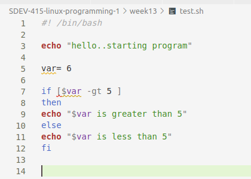
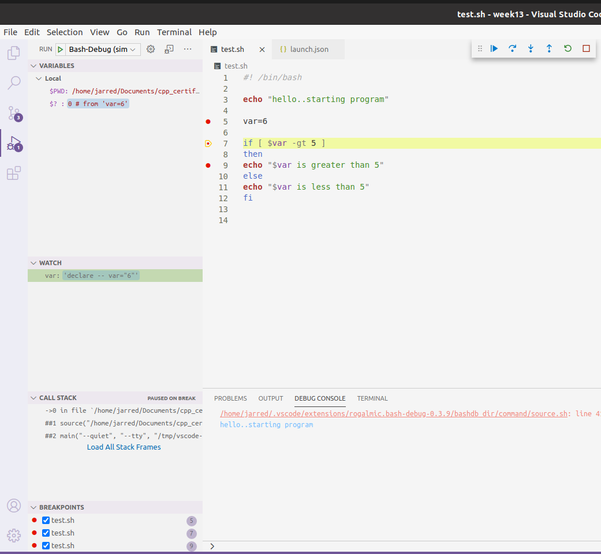

# Discussion Week 14

Please identify two common debugging techniques used in Bash Programming. For each technique, provide a unique example demonstrating how this technique helps a programmer find and fix errors.

Debugging is an important part of programming bash scripts. Two of the most common error types in bash programming are run-time errors and syntax errors.

The simples way to debug syntax errors is through a syntax highlighting or using a linting tool. I use VSCode for almost all of my programming needs, with one of the benefits being that I can import an extension for almost anything I need. One great script that exists for shell linting is [shell-check](https://marketplace.visualstudio.com/items?itemName=timonwong.shellcheck). Shell check will lint our shell script and highligh/underline any syntax errors it detects as we are programming. This is useful in catching errors that may exist before we run the program, such as a malfmored `if statement` or a variable that doesn't exist.

In the above code, we can see that a few of the errors I purposely put in the script are underlined. If I highlight over them, I can get an explanation of what needs to be changed.

Another, type of error, run-time or logic errors, can be handled using a debugger. VSCode also has bash debugger extension called [Bash Debug](https://marketplace.visualstudio.com/items?itemName=rogalmic.bash-debug). This extension is really useful for moving through a script line by line, watching how variables change, and using other tools of the debugger to trouble shoot any errors in a shell script.

In th eabove screenshot I am moving through the code in the debugger line by line. I am also have the `var` variable set to watch so I can see how to value changes over the runtime of the program. This is a really useful tool for debugging and figuring out what is wrong with a bash program.

**References**

(2020). Bash Debug. Retrieved from https://marketplace.visualstudio.com/items?itemName=rogalmic.bash-debug.

(2020). shellcheck. Retrieved from https://marketplace.visualstudio.com/items?itemName=timonwong.shellcheck.